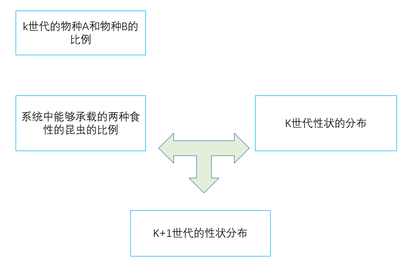
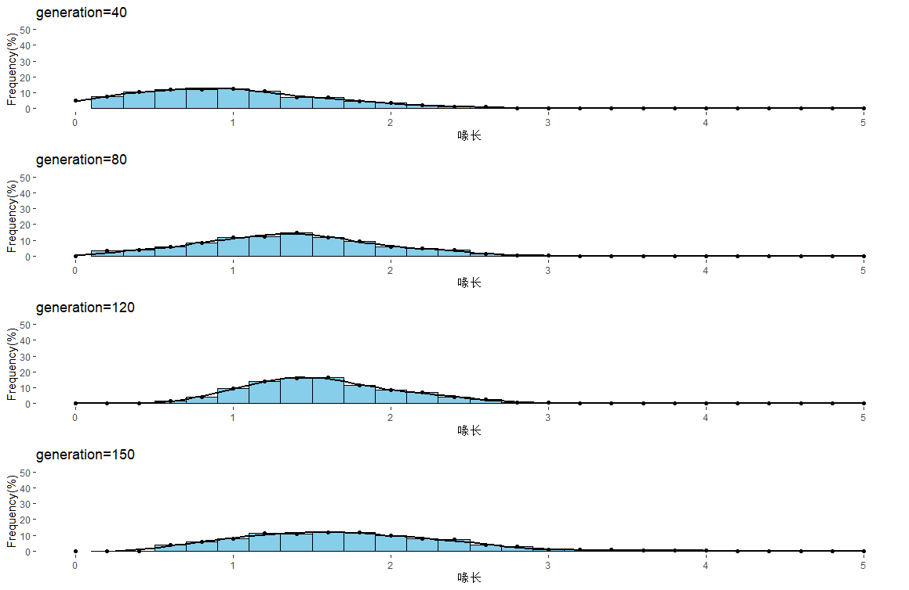
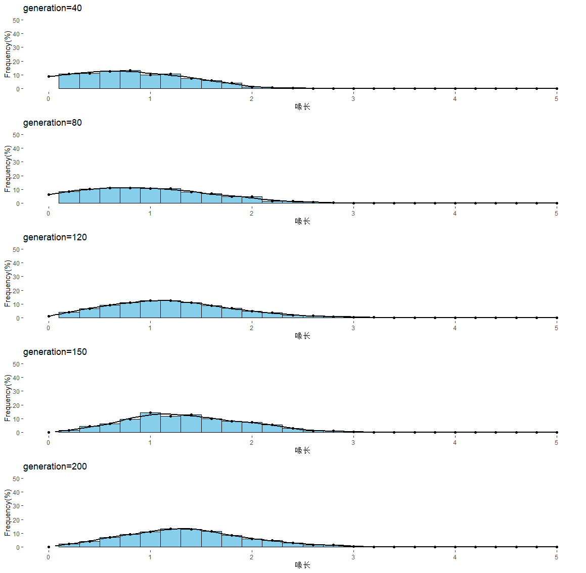

## 植物种群变化对昆虫数量影响的建模与分析

### 1. 简介：
  在生态系统中的生物进化是一种受生态因素制约的动态过程。植物的数量和其它特征的改变会影响以它为食的昆虫的生存和繁殖，直接表现为具有不同性状的昆虫适合度发生变化，从而影响其种群的基因以及表型频率。本文对于植物A，植物B和昆虫的数量变化，以及在变化中昆虫的口器分布建立了随机模型进行分析。同时对其他一些可能的情况进行了讨论。

### 2. 关于模型

  生态系统是一个及其复杂的系统，对其建立精细的模型是一件很难实现的事情，所以本文的模型都选取了最为主要的影响因素，而忽视了一些更为细小的影响因素。在建模方面，本文模拟了上限为1000只昆虫的种群动态和性状分布。主要分为以下三种情况进行建模讨论：
- 物种B逐步取代物种A，且昆虫一直专食物种A。
- 物种B逐步取代物种A，但是部分昆虫有能力取食物种B。
- 物种B在取代物种A的过程中受到昆虫的影响，即昆虫的取食使得物种B对物种A的竞争优势减弱。

### 3. 模型一
  模型一模拟了物种B逐年取代物种A时，昆虫的数量和性状的变化。
#### 3.1 模型的假设：
1. 昆虫每年发生一个世代，世代之间不连续。这是一个有很多证据的假设，而且对于吃果实的昆虫来说，以卵的形式度过没有果实的季节也是一个合理的假设。
2. 昆虫只取食物种A，不取食物种B。
3. 物种B在150年内以匀速逐年取代物种A。这是一个依据问题要求提出的简化假设，在模型三中还有会有更为详细的讨论。
4. 昆虫的种群存在一定的变异，其变异服从正态分布。
5. 昆虫后代的性状由其亲本的性状和随机变异线性加和而成。但是在本文中为了简单考虑假设昆虫是单亲繁殖的。这个假设也会在模型二和模型三中由更为详细的讨论。
6. 假设生态系统中最多可以承载1000只昆虫。这个假设为模拟界定了范围，同时因为生态系统的能量和资源时有限的，这也是一个较为合理的假设。

#### 3.2 模型的符号说明
$P_B$: 物种B在植物群落中所占的比例。
$P_A$: 物种A在植物群落中所占的比例。
$i$: 这个三生物系统经历的年代数，在这个模型中为1到150。另外的，因为昆虫是每年发生一个世代，所以这个参数也可以描述昆虫的世代数。
$gaussrand()$: 这是一个服从正态分布的随机数，用来描述物种性状的变异情况。其具体值由计算机生成。但是其分布的平均值和方差可以人为指定，这是一个模型建立后参数调节

#### 3.3 模型的建立
  由假设2可以得到，在150年内，物种B在群落中所占的比例大致为$P_B=\frac{i}{150}$。则物种A在群落中所占的比例应当为$P_A=1-\frac{i}{150}$。因为生态系统的资源总量有限，而昆虫只取食物种A。所以当物种A在群落中比例减少时，昆虫的数量也应当近似成比例减少。所以在模拟中，文章假设存在1000个位点，每一个位点代表一个昆虫个体。每一个个体是否在当前世代存活取决于群落中物种A的比例。即$P_(某一个位点存活)=P_A=1-\frac{i}{150}$
  对于每一个昆虫的喙长，假设其亲本的喙长为x。则其喙长为$x+gaussrand()$

#### 3.4 模型的求解与分析
  文章采用了一段C语言代码来实现“模型的建立”部分的功能。其源代码已经上传GitHub[1].这个模型的初始条件时假设所有1000个位点在开始都存活且喙长为1。

**图1：特定世代的喙长分布图**
  这幅图描述了在第50代和100代时昆虫的喙长分布。可以看出，在昆虫没有能力取食B时。其喙长的变化也没有受到太多的选择压力。因此在50世代和100世代时其喙长的分布基本不变。而且均值也稳定在初始设定的1左右。可能是因为随机漂变的原因所以两者之间还是存在一定的差异。

**图2：昆虫种群数量-世代**
  这幅图一初始值为100%每一代的数量对初始值的百分比作图。可以看出，如果昆虫找不到新的来源，那么它就会随着物种A数量的减少而灭绝。
  这个简单的模型描述了一个很可能的自然现象。比如当两个物种协同进化形成非常特异的性状时，就有可能在一方被取代时另一方也随之灭绝。如教科书上的兰花和天蛾就是经典的例子。

**图3：大慧星兰和天蛾的协同进化[2]**

### 4. 模型二
  在模型一的基础上，因为这种昆虫的喙长存在很大的变异，所以其中的一部分个体有可能达到物种B的种皮厚度，这样一来他们就有可能通过取食植物B获得新的能量来源。这些获得新营养的个体可以产生更多的后代来使得自己的性状得以传递下去并在种群中占据更高的比例。这个模型即是对于以上过程的模拟。
#### 4.1模型的假设
将这个模型的假设列举如下（其中假设1，3，4，8和上一个模型时相同的）：
1. 昆虫每年发生一个世代，世代之间不连续。这是一个有很多证据的假设，而且对于吃果实的昆虫来说，以卵的形式度过没有果实的季节也是一个合理的假设。
2. 昆虫可以取食物种A和物种B。
3. 物种B在150年内以匀速逐年取代物种A。这是一个依据问题要求提出的简化假设，在模型三中还有会有更为详细的讨论。
4. 昆虫的种群存在一定的变异，其变异服从正态分布。
5. 假设当昆虫的喙长超过物种B的果皮厚度后就只取食物种B。这是一个近似的简化假设，实际上他们可能是兼性饮食的。这一假设会改变昆虫的选择压力，但是在物种B替代物种A的过程中并不改变对昆虫的选择方向。
6. 昆虫后代的性状由：亲本的性状，所在类群的平均性状和随机变异线性加和而成。这个假设描述了下一代昆虫的性状是怎样生成的。
7. 假设昆虫只和自己食性相同的个体交配产生后代。这是一个为了建模简便而建立的假设，在自然的条件下，昆虫可能会没有这样强的选择性，但是食性相似的昆虫个体可能相互交配的概率更高是存在的。因为他们可能分布在更近的空间距离，由更多的相似特征。
8. 假设生态系统中最多可以承载1000只昆虫。这个假设为模拟界定了范围，同时因为生态系统的能量和资源时有限的，这也是一个较为合理的假设。

#### 4.2模型的符号说明
模型中的一些参数和上一个模型的相同，则不再赘述。
$a[j][k](k=0,1,2...999)$ :这个参数描述了第j代个体k的喙长。
$alen[j]$ :  第j世代取食物种A的昆虫个体的平均喙长
$blen[j]$ :  第j世代取食物种B的昆虫的平均喙长
$length$ : 能够取食物种B的长度阈值。达到这个阈值之后就可以取食B，在自然界中因为厚度其实是个数量性状，所以这个阈值是个合理假设，并不真实存在。在这个模型中设定的阈值为1.6。

#### 4.3模型的建立
根据上面的假设。对于某一个世代的昆虫，因为昆虫一般采取着$\gamma$对策，即他的数量一般可以达到环境所能容纳的上限。所以当环境中物种A所占的比例为$P_A$时，也大致可以养活$1000*P_A$个以A为食的昆虫。对于B也同理。因此这个模型还是模拟了1000个位点的种群的数量和性状的动态。其中对于后代的个体的性状的表达式和第一个模型有了一些差异，其具体表达式为：
$a[j+1][k]=0.9*a[j][parents]+0.1*alen+gaussrand()$
这个公式是对假设4，6，7的描述。式子中的0.9和0.1是两个经过调试的参数，描述看在后代性状的决定中亲本和亲本所在的群体所占的比重。$gaussrand()$是一个随机误差项。对于这个公式中参数也会调节出很多有趣的结果。

**图4：模型二的基本构建流程**

#### 4.4 模型的结果与分析

**图5：在模型二条件下不同世代的种群性状分布**
  从图中可以看出，在物种B逐步取代物种A时，因为随机变异的存在，有一部分的个体有能力取食物种B。这些个体因为获得了新的食物来源而得以繁殖。而且随着物种B在种群中的数量逐渐增加，口器长的个体在种群中所占的比例也逐渐增加。

**图6：在模型二的条件下世代-有能力取食物种B的个体比例**
  这幅图描述了在模型二的条件下有能力取食物种B的个体的比例。可以看出其数量随着预期逐渐的上涨。
  从结果中可以发现，总是有很大的一部分个体没有能力取食物种B。作者认为这有可能是因为首先变异是正态分布的，这样的分布描述的喙长变化是对称分布的，因此总会有一部分个体因为变异而使得喙长无法取食物种B。另外是可能物种自身的进化时间不够，植物B替代植物A花了150年，但是动物的进化对于植物来说可能是存在滞后的。因此应该模拟超过150代，这样在更长时间的选择下昆虫的喙长分布会存在改变。
  这个模型也描述了自然界中一个非常合理的现象，即当环境发生改变时，原本适应环境的性状变得不再合适。而一些具有其它性状的个体获得选择有优势而使得基因频率逐渐增加。

### 5. 模型三
  模型三在模型二的基础上进一步细化。引入了一个新的可能性，即昆虫的取食导致了物种B对物种A不再具有选择优势，这样一来可能会导致物种A和物种B长期的共存，也就有可能导致原来的昆虫分裂成取食两种不同植物的两个亚种甚至发生新的物种。
#### 5.1 模型的假设
这个模型相较模型二只有一个额外的假设：
1. 假设昆虫的取食会影响物种B的竞争力。即物种B在群落中的频率不再像前两个模型的一样线性增加。而是时间和昆虫数量的函数。

#### 5.2 模型的参数约定
$b$ : 模型中可以取食物种B的个体的数量。

#### 5.3 模型的建立
基本的模拟过程和模型二相似。但是在物种B的频率改为了如下模型：
$P_B=i/150-b/1000  (i<150) or P_B=1-b/1000 (i\geq150)$，这个方程类似于逻辑斯蒂增长中的资源消耗项，即当昆虫中的可以取食物种B的个体比例增加时。对于物种B的压力增大。
同时因为在上一个模型中，可能由于物种进化的时间不够导致了昆虫种群的基因频率和预期存在差异。同时也想要探究在更长时间下的种群动态。所以在模型中进行了300世代的模拟。

#### 5.4 模型的结果与分析

**图7：世代-昆虫性状图**
这幅图描述了在40，80，120，150，200世代情况下的昆虫种群喙长分布。可以发现在初始的50个世代中，因为物种B较少所以喙长较长的个体并不占优势。但是随着物种B环境容纳量的逐渐增加，昆虫的喙长也在逐渐变化，但是直到200世代，昆虫的喙长(众数=1.4）也没有达到模型二中的(众数=1.6）说明了昆虫的喙长并没有像物种B完全取代物种A时那样增长。更为详细的分析看接下来的图。

**图8：在模型三的条件下世代-有能力取食物种B的个体比例**
  从图中也可以较为明显的看出，即使种群数量存在波动和更长进化时间。昆虫中能够取食物种B的个数也无法达到模型二中物种B完全取代物种A时的情况。这说明了尽管物种B对物种A存在竞争优势，外界条件也有可能使得其优势减弱从而改变竞争的最终结局。
  同时通过引入昆虫对于植物的影响，这个模型中还出现了自然种群中常见的种群数量年际波动。这样的波动在自然界更为复杂的体系中也可以以更为复杂的形式出现，可能会营造出更多不同的环境条件组合（生态位），从而形成可以供许多生物同时生存的庞大生态系统。

### 6. 讨论
  本文建立了由简到繁的三个物种数量和性状变化模型。利用相对简单的参数设置和模型假设实现了一些进化上可能的情况。
  但是模型还存在一些值得改进的地方。比如说在模型一中，下一代物种的性状是由一个亲本的性状加上一个随机变异构成的，这样的假设虽然简单，但是因为没有考虑到亲本之间的基因交流，所以实际上增大了种内变异。
  同时还有一些出于精力而没有实现的功能，比方说在模型二和模型三中，没有引入负选择的机制。即那些在物种A和物种B的果皮厚度之间个体，可能会因为在这个长度上物种A和物种B的个体都很少而无法获得足够的资源来生存。没有这样的负选择机制导致在模型三中的物种的性状分布并没由出现预期的双峰现象。从而也就很难预测这种昆虫以后是否有可能分化成两个不同的物种。

[1]: 本文的所有使用的代码和中间数据和数据处理的代码均已经上传到GitHub库中，可以通过下面的连接访问获取：

​             https://github.com/liushangjian/modeling2

### 参考文献
[2]: http://media.tinmoitruong.vn/public/media/media/picture/08/3(33).jpg